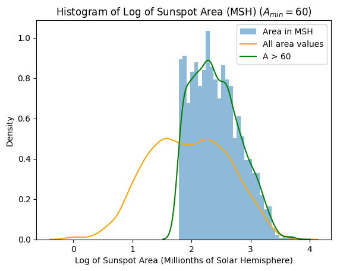
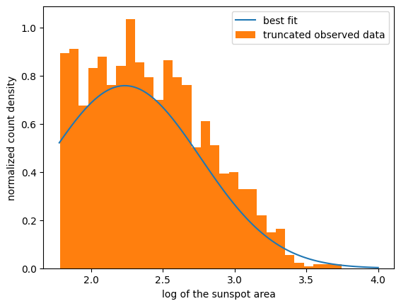
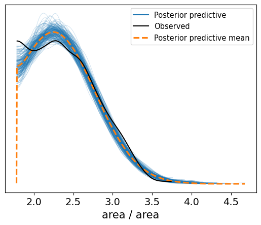

# Area distribution of Sunspots

  

What is the size distribution of sunspots above the lower bound of reliable size measurements?  

        

### Background  

Sunspots play an important role in the magnetic dynamics of the sun and can indicate local processes near the surface. They are also a signal of overall solar activity, so understanding their prevelance can be an important foundational tool for further research in the field. [Previous research](https://www.aanda.org/10.1051/0004-6361:20053415) has modeled the number density of sunspots over all whole spot areas using a log-normal distribution, which is the prescription we will follow in this project.

This reference also recommends not using the full data set and only performs the fit above an area of $A_{min} = 60$ millionths of a solar hemisphere (MSH) as they are "falsified from enhanced intrinsic measurement errors as well as from distortions due to atmospheric seeing". Therefore, this requires the use of a truncated log-normal to appropriately model the data, and we will only focus on the data with at least a size of 60 MSH.

### Data

The data for this project was obtained from the [UK Solar System Data Centre](https://www.ukssdc.ac.uk/wdcc1/greenwich/). It contains all sunspot group reports from 1874 to 1981. Because each year contains so much information and data, we selected years 1976 and 1968. The reason why 1968 was chosen as one of the years is because it was when the solar maximum, the most observed amount of sunspots in a solar cycle, occurred. 1976 was then chosen as it was the last year of the of the Greenwich sunspot record. Only the area of complete sunspot groups and not of individual sunspots have been recorded.

After selecting these two .grp files, we moved them into an excel sheet and separated the columns according to the grnwich.fmt file which tells what each column means. So for instance, columns 1-4 tell the year so we separated data by that.

[UK Solar System Data Center](https://www.ukssdc.ac.uk/wdcc1/greenwich/) (Need to register [here](https://www.ukssdc.ac.uk/cgi-bin/wdcc1/userreg.pl) and use email as the credential with password being blank.)  
[GDrive](https://drive.google.com/uc?id=1nOktHZ4Qs8jKDr2GPzAje64YlsDZdysb)

### Software setup to run the notebook

Python version used: `3.10.12`  

We recommend using a `conda` environment to install the requirements and run the notebook.  

1. Install Conda
Conda can be installed from this page: https://conda.io/projects/conda/en/latest/user-guide/install/index.html.  

2. Create a conda environment
```
conda create --name ast5731_group3_project3 --file requirements.txt
```
You can change the name of the environment from `ast5731_group3_project3` to the one you want.

3. Install Jupyter notebook from this page: https://jupyter.org/install  

4. The notebook can be run using by starting the jupyter notebook server

```
# to start the server
jupyter notebook
```

Navigate to the file and run the `Group3_Project3.ipynb`

#### Team

<table>
  <tr>
    <td align="center"><a href="https://github.com/Raghuram-Veeramallu"><br /><sub><b>Hari Veeramallu</b></sub></a></td>
    <td align="center"><a href="https://github.com/jalatoma"><br /><sub><b>Jacynda Alatoma</b></sub></a></td>
    <td align="center"><a href="https://github.com/nkruegler"><br /><sub><b>Nicholas Kruegler</b></sub></a></td>
    <td align="center"><a href="https://github.com/DanielWarshofsky"><br /><sub><b>Daniel Warshofsky</b>
  </td>
    <td align="center"><a href="https://github.com/ChrisG0407"><br /><sub><b>Christopher Guo</b></sub></a></td>
</tr>
</table>
